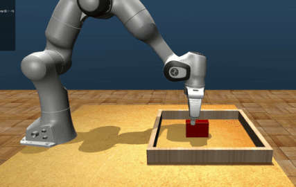

# MuJoCo-Example-Manipulation

Welcome to **MuJoCo-Example-Manipulation**, a repository designed to showcase practical examples of robotic manipulation using DeepMind's **[MuJoCo](https://github.com/google-deepmind/mujoco)** framework.

## Installation

1. Make sure you have Docker installed on your machine.

2. Clone this repository:

    ```bash
    git clone git@github.com:shihminyang/MuJoCo-Example-Manipulation.git
    ```

3. Navigate to the project directory:

    ```bash
    cd MuJoCo-Example-Manipulation
    ```

4. Build the Docker image using the provided Dockerfile:

    ```bash
    docker build -t mujoco_example_manipulation .
    ```

5. (Option) Enable X11 Forwarding to run GUI in Docker
    ```bash
    xhost +local:10
    ```

6. Once the Docker image is built, you can run a container using the following command:

    ```bash
    docker run -it --rm --network=host --privileged \
	-v .:/mujoco_example mujoco_example_manipulation /bin/bash
    ```
    This command will run the container and mount the current local folder as a volume (to share the local folder with the container).


## Usage

1. Control a Franka Emika Panda arm by operational space controller
```bash
python example_move_osc.py
```


2. Perform object flipping
```bash
python example_flip.py
```
3. Perform object grasping
```bash
python example_grasp.py
```

4. Perform camera moving (camera pose)
```bash
python example_move_camera.py
```




## Reference
The Franka Emika Panda model is referenced from **[mujoco_menagerie](https://github.com/google-deepmind/mujoco_menagerie)**.